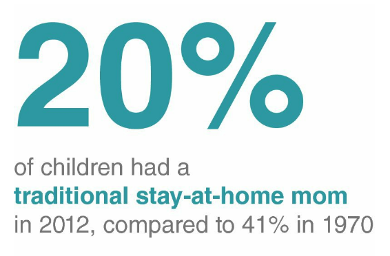
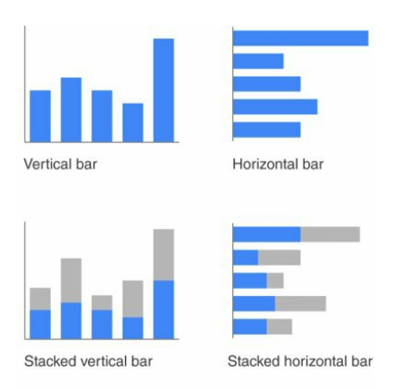
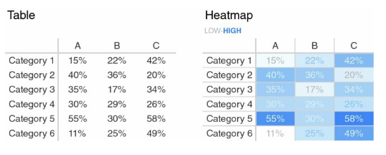
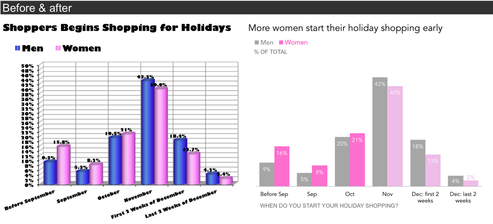
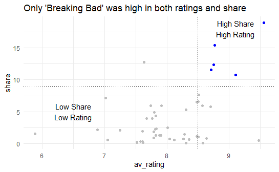
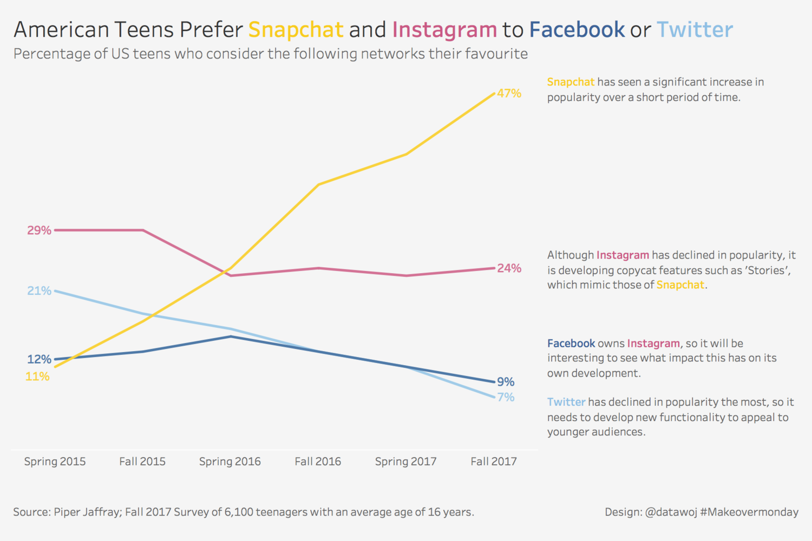

```{r setup, include=FALSE}
library(here)
library(readr)
library(tidyverse)
library(here)
```

```{r xaringan-themer, include = FALSE}
library(xaringanthemer)
mono_light(
    base_color = "midnightblue",
  header_font_google = google_font("Josefin Sans"),
  text_font_google   = google_font("Montserrat", "300", "300i"),
  code_font_google   = google_font("Droid Mono"),
  link_color = "deepskyblue1",
  text_font_size = "28px"
)
```

# Overview

- Adjust your attitude
- Knowing Your Audience/Building a Story
- Some visuals for presenting
- Highlight your message visually

---
class: center, middle
# Adjust Your Attitude

---
# Motivation: Exploratory versus Explanatory

.pull-left[
**Exploratory analysis**: 
  - exploring and understanding the data, conducting the analysis
]
.pull-right[
**Explanatory analysis**: 
  - explaining your findings from your analysis in a coherent narrative that leads to a call to action
]
---
# You are not your audience

- Think about what matters to your stakeholders
- Adjust your language
- Adjust your metrics

---

class: center, middle
# Know Your Audience and Build Your Story

---
# Three Questions before you even make slides and figures

--
- For whom?
--

- What is your call to action?
--

- What are your findings? How will you communicate them using the available data?

.footnote[Cole Nussbaumer Naflic, [Storytelling with Data](http://www.storytellingwithdata.com/books)]

---
# Who is your audience?

- What are their values?
- What are their strengths?
- How should you tailor your message?

---
# What is your call to action?

- What action do you want your audience to take?
- Example: For a pilot project of LACE:
  - What were your results on your pilot project?
  - What would it take to bring the project to the larger organization?

---
# What data do you need to tell your story?

Your call to action drives this!

- What datasets/tables/metrics?
- What numbers are meaningful?
- Should you subset the data?
- How should you present it visually?

---
class: center, middle

# Visuals for Presenting

---
# Types of visuals

- Numbers
- Barplots
- Heatmaps

---
# Just use the number

.pull-left[
Tables do require mental processing. It may be worth it to just use the number as the visual.
]

.pull-right[
```{r echo=FALSE}

```
]

.footnote[Storytelling with Data]

---
# Barplots

.pull-left[
- Sometimes simpler is better
- Can highlight changes
]

.pull-right[
```{r echo=FALSE}

```
]
.footnote[Storytelling with Data]
---
# Heatmaps

.pull-left[
May be better than straight tables! Highlight differences using color.
]

.pull-right[
```{r echo=FALSE}

```
]

.footnote[Storytelling with Data]
---
class: center, middle
# Highlighting your message

---
# Effective Visual Communication

Focus on three techniques

- Decluttering your graph
- Annotating your graph
- Highlighting Data using Preattentive Attributes (color)

---
class: center, middle
# Part 1: Declutter your graph

---
# Why do we need to declutter our graphs?

- Reduce cognitive load (help tired and cranky viewers)
- Viewer can focus on what matters
- Not all information is useful for your viewer

---
# Example: London Subway Diagram

.pull-left[
```{r echo = FALSE}
knitr::include_graphics("image/london-underground.jpg")
```
]

.pull-right[
- Triumph of minimal design
- Removes geography
- Emphasizes: what lines to I take to get from A to B?
]

.footnote[http://theconversation.com/sublime-design-the-london-underground-map-26240]

---
# Cognitive Load

- Think of your audience: 
    - Tired and cranky and want you to get to the point!
    - Short term memory 5 +/- 2 things at once
- Remove elements that distract from your message
    - Shadows, 3D Effects
    - Legends/too many colors 
    - Axis Titles (sometimes)

---
# Ask Yourself

- Does this element support [the point I want to make about the data?](http://www.storytellingwithdata.com/blog/2017/3/29/declutter-this-graph)

```{r echo=FALSE}

```

---
class: center, middle
# Part 2: Annotating Your Graphs

---
# Guiding Your Viewer 

Another way we can guide people through our visualization is by using **annotations**, which can be very helpful in guiding someone through our figure. Let's review some best practices.

---
# Use your titles/captions!

- Titles can guide people to the point of your figure
- Primes people to know what to look for
- "If there is a conclusion you want your audience to reach, state it in words" - Cole Nussbaum Knaflic
---
# Don't label everything

.pull-left[- Think about only labeling the data that matters
- If you want someone to compare two shows, label them
- Think about groupings and "super categories" to help your viewers make sense of the graph]

.pull-right[

]
---


.footnote[https://datawoj.co.uk/visualising-data-on-which-social-media-network-us-teenagers-prefer/]

---
class: center, middle
# Part 4: Highlighting Data 

---
# Preattentive attributes

.pull-left[
Color and contrast are known as `preattentive attributes`. Our unconscious brain is aware of these kinds of attributes even before we consciously process the content of a graph.

How many 3s are there in this image?
]

.pull-right[
```{r echo=FALSE}

```
]

.footnote[[Storytelling with Data](http://storytellingwithdata.com/)]
---
# How about now?

.pull-left[
You can use color and contrast to highlight aspects of the data. How many 3s are there in this image now? Notice how much quicker you can count them. 

That's the power of preattentive attributes!
]

.pull-right[
```{r echo=FALSE}

```
]

.footnote[[Storytelling with Data](http://storytellingwithdata.com/)]
---
# Best Practices for Using Color (Stephen Few)

- Use color only when needed to serve a particular communication goal
- Use different colors only when they correspond to differences of meaning in the data.
- Use soft, natural colors to display most information and bright and/or dark colors to highlight information that requires greater attention.

.footnote[[Practical Rules for Using Color](http://www.perceptualedge.com/articles/visual_business_intelligence/rules_for_using_color.pdf)]

---


.footnote[
https://datawoj.co.uk/visualising-data-on-which-social-media-network-us-teenagers-prefer/
]
---
# Conclusions

Congrats! You're well on your way to learning how to make your figures more accessible.

---
class: center, middle
# Putting it all Together

---
```{r echo=FALSE}
knitr::include_graphics("image/David_H.png")
```
.footnote[https://t.co/KSGQzaH0Mh]
---
class: center, middle

# Going Farther
---
# `ggplot2` flipbook

Good examples for styling your plots!

https://evamaerey.github.io/ggplot_flipbook/ggplot_flipbook_xaringan.html

- [Arctic Ice](https://evamaerey.github.io/ggplot_flipbook/ggplot_flipbook_xaringan.html#226)
- [Flipping Seats](https://evamaerey.github.io/ggplot_flipbook/ggplot_flipbook_xaringan.html#302)
- [Milk Cows](https://evamaerey.github.io/ggplot_flipbook/ggplot_flipbook_xaringan.html#354)
---
# Recap

- You are not your audience
- Have an ask, and connect your results to it
- Pick good visuals
- Pare your visuals down and highlight

---
# References

- Source for these slides: https://github.com/laderast/data_storytelling_talk
- [Storytelling with Data RStudio Project (Optional)](https://rstudio.cloud/project/1192661)
- [Allison Sliter: Data Presentation for Everyone](https://ww2.amstat.org/meetings/sdss/2019/onlineprogram/AbstractDetails.cfm?AbstractID=306642)
- [`ggplot2` flipbook](https://evamaerey.github.io/ggplot_flipbook/ggplot_flipbook_xaringan.html)
- [Alison Hill: Take a Sad Plot and Make it Better](https://alison.rbind.io/talk/2018-ohsu-sad-plot-better/)
- [Storytelling with Data](http://www.storytellingwithdata.com/books)
- Slides are done with xaringan/xaringanthemer
